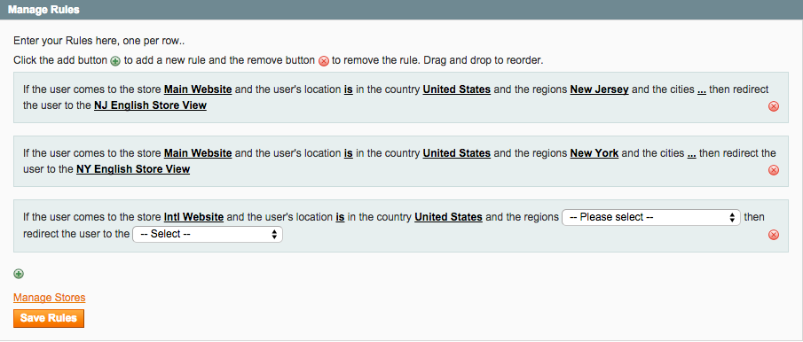

GeoStores
================

Description
-----------
Reroute users to stores based on their geography: country, region/state, city. This extension checks
the user's IP address and matches it to your business rules for what stores serve which 
geographies. For example, if you want all Canadian users to go to your Canadian store, create a
rule. When a Canadian user comes to your site, their IP address location will be checked against 
this rule and the user will be routed accordingly. 

How to use
-------------------------
Upload files to root of your Magento install. In System -> Configuration -> General -> GeoStores,
enable this extension. 

Include this line:

<pre>
/* Check user IP address according to GeoStores rules */
require_once MAGENTO_ROOT . '/app/code/community/Aydus/GeoStores/includes/GeoStores.php';
</pre>
at the bottom of the index.php file that is in the root of your Magento install. For example:
<pre>
...
/* Run store or run website */
$mageRunType = isset($_SERVER['MAGE_RUN_TYPE']) ? $_SERVER['MAGE_RUN_TYPE'] : 'store';

/* Check user IP address geography according to business rules */
require_once MAGENTO_ROOT . '/app/code/community/Aydus/GeoStores/includes/GeoStores.php';

Mage::run($mageRunCode, $mageRunType);
</pre>

Enable the extension in the admin under System -> Configuraton -> General -> GeoStores.

In the admin under System -> Manage Stores -> GeoStores, configure your geo business rules:

